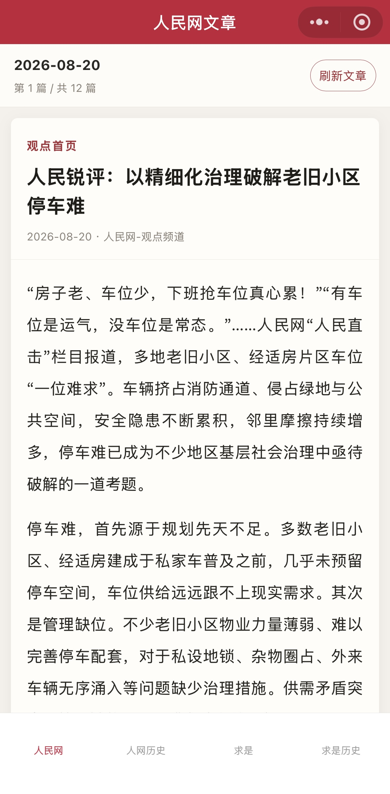
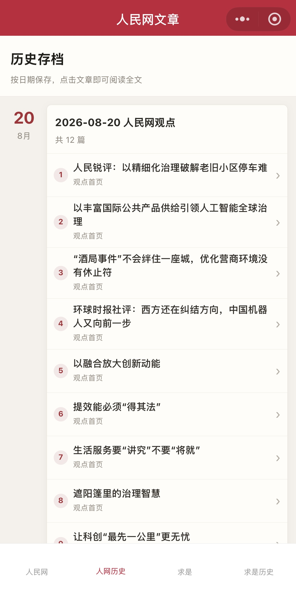
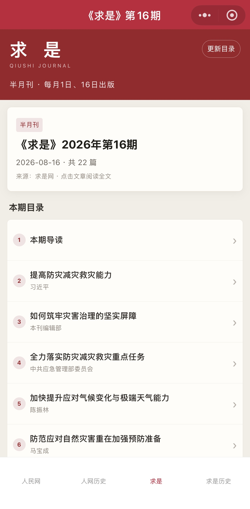
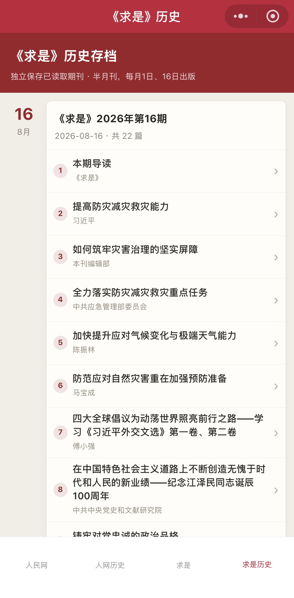

# 申论素材库

[](https://github.com/Czw040526/shenlun-miniapp/actions/workflows/test.yml)

一个用于个人申论备考的微信小程序，按日期归档并阅读人民网观点频道文章，同时整理《求是》半月刊目录与全文。

项目采用“微信小程序 + 腾讯云函数 + 云数据库”架构。首次打开内容时由云函数抓取官网页面并归档，后续直接读取云端存档。项目不生成 AI 讲解，不需要 OpenAI、DeepSeek 等大模型 API Key。

## 效果展示

<table>
  <tr>
    <td width="50%"></td>
    <td width="50%"></td>
  </tr>
  <tr>
    <td align="center">人民网文章阅读</td>
    <td align="center">人民网历史存档</td>
  </tr>
  <tr>
    <td width="50%"></td>
    <td width="50%"></td>
  </tr>
  <tr>
    <td align="center">《求是》本期目录</td>
    <td align="center">《求是》历史存档</td>
  </tr>
</table>

## 主要功能

- 人民网观点文章按日读取，支持上一篇、下一篇和刷新文章。
- 首次读取时由腾讯云函数抓取正文并存档，后续直接读取云数据库。
- 人民网历史记录按日期组织，可进入任意文章阅读全文。
- 《求是》按每月 1 日、16 日的半月刊节奏读取最新一期目录。
- 《求是》历史记录独立存储，并支持补齐当年已经发布的期刊。
- 四个底部导航入口：人民网、人民网历史、求是、求是历史。
- 无需本地服务器、桌面定时任务或大模型 API。

## 工作方式

```text
微信小程序
  └─ 调用腾讯云函数
       ├─ 读取 daily_materials / qiushi_issues
       └─ 首次缺少存档时调用 fetchPage 抓取官网页面
            ├─ opinion.people.com.cn
            └─ qstheory.cn
```

网页抓取和数据库访问都在云函数中完成，小程序前端不保存第三方密钥。

## 项目结构

```text
shenlun-miniapp/
├─ miniprogram/                     # 微信小程序前端
│  ├─ pages/index/                  # 人民网文章阅读
│  ├─ pages/history/                # 人民网历史存档
│  ├─ pages/qiushi/                 # 《求是》本期目录
│  ├─ pages/qiushi-history/         # 《求是》历史存档
│  └─ pages/detail/                 # 文章详情页
├─ cloud/functions/
│  ├─ fetchPage/                    # 抓取网页
│  ├─ getDailyMaterial/             # 人民网当日文章
│  ├─ getHistory/                   # 人民网历史索引
│  ├─ getArticleDetail/             # 单篇文章与前后篇定位
│  ├─ getQiushiIssue/               # 《求是》目录、归档与定时同步
│  └─ getQiushiHistory/             # 《求是》历史索引
├─ test/                            # 网页解析单元测试
├─ docs/screenshots/                # GitHub 效果展示图
├─ cloudbaserc.example.json         # CloudBase CLI 配置模板
├─ project.config.json              # 微信开发者工具项目配置
└─ package.json                     # 本地及 GitHub Actions 测试入口
```

## 从零配置与部署

### 1. 注册微信小程序

1. 在[微信公众平台](https://mp.weixin.qq.com/)注册小程序。
2. 在“小程序后台 → 开发管理 → 开发设置”中找到 AppID。
3. 安装并登录微信开发者工具。

### 2. 下载并导入项目

```bash
git clone https://github.com/Czw040526/shenlun-miniapp.git
```

在微信开发者工具中选择“导入项目”，项目目录选择克隆后的 `shenlun-miniapp` 文件夹。

仓库中的 `project.config.json` 使用 `touristappid` 占位。导入时填写自己的 AppID，或将该文件中的：

```json
"appid": "touristappid"
```

替换为自己的 AppID。

### 3. 开通腾讯云开发

1. 打开项目后，点击微信开发者工具顶部的“云开发”。
2. 按提示创建一个云开发环境。
3. 记录环境 ID，例如 `cloud1-xxxx`。
4. 打开 `miniprogram/app.js`，将：

```js
env: 'your-cloudbase-env-id'
```

替换为自己的环境 ID。

如果使用 CloudBase CLI，再复制 `cloudbaserc.example.json` 为 `cloudbaserc.json`，并把其中的 `your-cloudbase-env-id` 替换为相同的环境 ID。真实的 `cloudbaserc.json` 已被 Git 忽略。

### 4. 创建云数据库集合

在“云开发 → 数据库”中依次创建：

| 集合 | 用途 |
| --- | --- |
| `daily_materials` | 人民网每日文章正文与元数据 |
| `qiushi_issues` | 《求是》期刊目录、文章与历史记录 |

小程序前端不会直接读写这些集合，建议将集合权限设置为仅云函数或管理端可读写。

若控制台提示 `daily_materials` 的日期排序缺少索引，请为字段 `date` 创建降序索引。

### 5. 部署云函数

按下面顺序部署：

| 顺序 | 云函数 | 超时 | 内存 | 说明 |
| ---: | --- | ---: | ---: | --- |
| 1 | `fetchPage` | 60 秒 | 256 MB | 抓取人民网和求是网页 |
| 2 | `getDailyMaterial` | 60 秒 | 512 MB | 读取或首次归档人民网当日文章 |
| 3 | `getHistory` | 20 秒 | 256 MB | 读取人民网历史索引 |
| 4 | `getArticleDetail` | 60 秒 | 256 MB | 读取单篇文章和前后篇位置 |
| 5 | `getQiushiIssue` | 180 秒 | 512 MB | 读取、补齐并归档《求是》期刊 |
| 6 | `getQiushiHistory` | 180 秒 | 512 MB | 读取《求是》历史存档 |

在微信开发者工具的文件树中展开 `cloud/functions`，对上述每个函数目录执行：

1. 右键函数目录。
2. 选择“上传并部署：云端安装依赖”。
3. 等待部署成功后再继续下一个函数。

函数名必须与目录名完全一致。所有函数均使用 Node.js 20 运行时；相关超时和内存值已经写入各自的 `config.json` 及 `cloudbaserc.example.json`。

### 6. 上传《求是》定时触发器

`getQiushiIssue/config.json` 配置了每月 1 日和 16 日北京时间 12:00 的同步任务。

部署 `getQiushiIssue` 后，再右键该函数并执行“上传触发器”。如果暂时不需要自动同步，也可以不上传触发器；首次打开《求是》页面时仍会按需读取。

### 7. 首次运行与验证

1. 点击微信开发者工具的“编译”。
2. 打开“人民网”，确认能显示当天文章；首次加载会比缓存读取更慢。
3. 打开“人民网历史”，确认当天记录已经归档。
4. 打开“求是”，确认能显示官网已经发布的最新一期。
5. 首次打开“求是历史”，等待云函数补齐当年期刊。

也可以在云函数测试面板中手动验证：

`getDailyMaterial`：

```json
{
  "date": "2026-08-20",
  "force": true
}
```

`getQiushiIssue` 年度回填：

```json
{
  "action": "backfill",
  "year": 2026,
  "date": "2026-08-20"
}
```

部署到其他年份时，把示例日期和年份替换为实际值。

## 常见问题

### 提示“云开发环境不存在”

检查 `miniprogram/app.js` 中的环境 ID 是否与微信开发者工具当前选择的云环境一致。

### 提示“云函数不存在”

确认六个函数已经上传成功，且云端函数名与目录名完全一致。

### 人民网页面没有文章

先在云函数测试面板运行 `fetchPage` 或 `getDailyMaterial`，检查云函数是否能访问外网，以及目标日期是否已有文章发布。必要时把 `fetchPage` 和 `getDailyMaterial` 超时保持为 60 秒。

### 《求是》历史回填超时

确认 `getQiushiIssue` 和 `getQiushiHistory` 的超时均为 180 秒、内存为 512 MB。首次年度回填数据较多，完成时间会明显长于普通读取。

### 新一期日期到了但目录还是上一期

这是预期降级行为：当官网新一期目录尚未上线时，小程序继续显示最近一个已发布期刊，不提前显示空目录。

### 数据库提示无权限或缺少索引

确认两个集合名称拼写正确，并允许云函数管理端访问；按照控制台提示补充 `date` 等查询索引。

## 本地测试

安装 Node.js 20 后，在项目根目录运行：

```bash
npm test
```

测试覆盖人民网文章解析和《求是》期刊解析，不需要安装依赖或填写 API Key。相同测试也会由 GitHub Actions 自动执行。

## 公开仓库安全说明

以下本地配置已被 Git 忽略：

- `cloudbaserc.json` 中的真实腾讯云环境 ID
- `project.private.config.json` 中的开发者工具个人设置
- `.env`、`node_modules`、日志和构建产物

`project.config.json` 和 `miniprogram/app.js` 均使用占位值。Fork 或克隆后请替换为自己的 AppID 和云环境 ID，不要把 API Key、访问令牌或其他密钥写入源码。

## 内容与版权

本项目用于个人学习、技术研究和内容归档。文章版权归人民网、《求是》杂志社、原作者及其他相关权利人所有。请遵守目标网站规则、微信平台规范和适用法律，不要将抓取内容用于未经授权的转载或商业分发。
